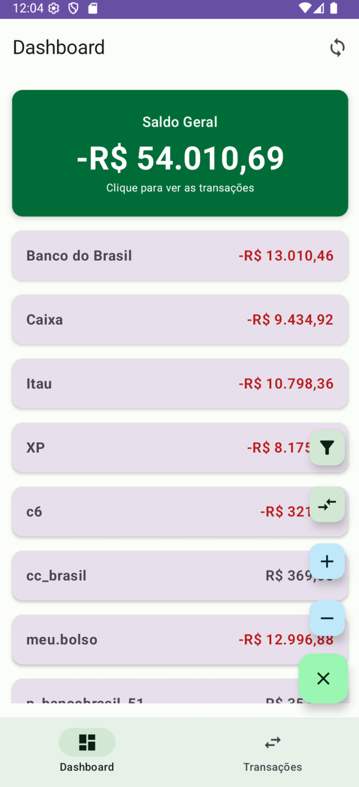
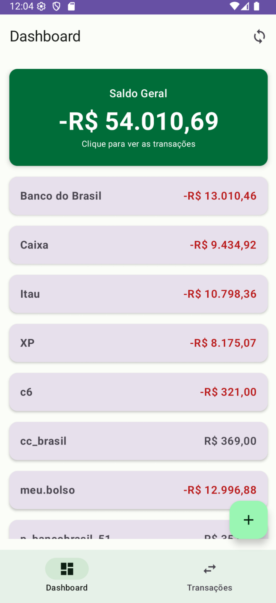

# Minhas Economias - Aplicativo Android 💰

# Minhas Economias – App Android de Finanças Pessoais

Este é um aplicativo Android para gerenciamento de finanças pessoais, desenvolvido com foco em uma arquitetura moderna e na experiência do usuário.

Ele permite o controle de receitas e despesas com uma abordagem *offline-first*, garantindo o funcionamento mesmo sem conexão à internet e a sincronização automática dos dados com um servidor backend assim que houver conectividade.

> 🔗 O código-fonte do backend que dá suporte a este aplicativo está disponível em: [laurobmb/minhas_economias](https://github.com/laurobmb/minhas_economias)

## 📸 Telas do Aplicativo

<table>
  <tr>
    <td align="center">
      
      <br />
      <sub><b>Tela de Login</b></sub>
    </td>
    <td align="center">
      
      <br />
      <sub><b>Dashboard</b></sub>
    </td>
    <td align="center">
      
      <br />
      <sub><b>Adicionar Transação</b></sub>
    </td>
  </tr>
  <tr>
    <td align="center">
      
      <br />
      <sub><b>Filtrar Transações</b></sub>
    </td>
    <td align="center">
      
      <br />
      <sub><b>Nova Transferência</b></sub>
    </td>
    <td align="center">
      
      <br />
      <sub><b>Menu de Ações</b></sub>
    </td>
  </tr>
</table>

## ✨ Funcionalidades

  * **Login e Sincronização:** Autenticação de usuário e sincronização segura dos dados com um servidor backend.
  * **Dashboard Financeiro:** Visualização rápida do saldo geral e do saldo de cada conta cadastrada.
  * **Gestão de Transações (CRUD):** Adicione, edite e remova receitas ou despesas de forma intuitiva.
  * **Transferências entre Contas:** Realize transferências de valores entre suas contas.
  * **Filtragem Avançada:** Busque transações por descrição, período (data de início e fim), categoria ou conta.
  * **Modo Offline-First:** Todas as operações são salvas localmente primeiro, permitindo o uso contínuo do app sem conexão. A sincronização ocorre de forma transparente.
  * **Interface Moderna:** Construído inteiramente com Jetpack Compose, seguindo os padrões do Material Design 3.

-----

## 🛠️ Tecnologias Utilizadas

Este projeto foi construído utilizando as seguintes tecnologias e bibliotecas:

  * **Linguagem:** [Kotlin](https://kotlinlang.org/)
  * **UI:** [Jetpack Compose](https://developer.android.com/jetpack/compose) para uma interface declarativa e moderna.
  * **Arquitetura:** MVVM (Model-View-ViewModel) para uma separação clara de responsabilidades.
  * **Banco de Dados Local:** [Room](https://developer.android.com/training/data-storage/room) para persistência de dados e suporte offline.
  * **Comunicação com API:** [Retrofit 2](https://square.github.io/retrofit/) e [OkHttp](https://square.github.io/okhttp/) para chamadas de rede.
  * **Programação Assíncrona:** [Kotlin Coroutines](https://kotlinlang.org/docs/coroutines-overview.html) e [Flow](https://kotlinlang.org/docs/flow.html) para gerenciar operações em background.
  * **Navegação:** [Navigation Compose](https://developer.android.com/jetpack/compose/navigation) para gerenciar a navegação entre as telas.
  * **Injeção de Dependência:** Manual através de `ViewModelProvider.Factory`.

-----

## 🏗️ Arquitetura

O aplicativo segue o padrão de arquitetura **MVVM**, com as seguintes camadas:

  * **View (UI Layer):** Composta por Composable Functions (`MainActivity.kt`) que observam os `StateFlow`s do ViewModel para renderizar a UI.
  * **ViewModel (`MovimentacaoViewModel`):** Contém a lógica de negócios da UI, expõe o estado para a View e gerencia as interações do usuário, delegando a busca e manipulação de dados para o Repository.
  * **Repository (`MovimentacaoRepository`):** Única fonte de verdade para os dados. Ele decide se busca os dados do banco de dados local (Room) ou da API remota (Retrofit), além de gerenciar a lógica de sincronização.
  * **Model (Data Layer):** Inclui as fontes de dados:
      * **Remoto:** `ApiService` (interface Retrofit) para comunicação com o backend.
      * **Local:** `AppDatabase` (Room), DAOs (`MovimentacaoDao`, `CategoriaDao`, `ContaDao`) e as entidades de dados.

-----

## 🚀 Como Executar o Projeto

Para compilar e executar o projeto, siga os passos abaixo:

1.  **Clone o repositório:**

    ```bash
    git clone <URL_DO_SEU_REPOSITORIO>
    ```

2.  **Abra no Android Studio:**

      * Abra o Android Studio (versão Hedgehog ou mais recente).
      * Selecione "Open an existing project" e navegue até a pasta do projeto clonado.
      * Aguarde o Gradle sincronizar as dependências.

3.  **Execute o App:**

      * Conecte um dispositivo Android ou inicie um emulador.
      * Clique no botão "Run 'app'".

-----

## ⚠️ Observação Importante sobre o Backend

Este aplicativo é um **cliente** e foi projetado para se comunicar com um servidor backend. O código do servidor não está incluído neste repositório.

  * **Configuração do Servidor:** Antes de fazer o login, você **precisa** informar o endereço do seu servidor na tela de login. O `ServerUrlManager.kt` é responsável por salvar essa URL.
  * **Endpoints Esperados:** O servidor deve prover os endpoints definidos na interface `ApiService` em `MainActivity.kt`, como `/login`, `/api/movimentacoes`, `/api/saldos`, etc.

-----

## 📁 Estrutura do Projeto

Os arquivos principais estão localizados em `app/src/main/java/com/example/minhaseconomias/`:

  * `MainActivity.kt`: Contém a Activity principal e todos os Composable Functions que constroem as telas do aplicativo (Login, Dashboard, Transações, Filtros, etc.).
  * `Database.kt`: Define o banco de dados Room, incluindo as entidades (`Movimentacao`, `CategoriaSugerida`, `ContaSugerida`) e os DAOs para acesso aos dados.
  * `ServerUrlManager.kt`: Um objeto singleton para gerenciar e persistir a URL do servidor backend informada pelo usuário.
  * `ui/theme/`: Contém os arquivos de tema do Jetpack Compose (`Color.kt`, `Theme.kt`, `Type.kt`) que definem a paleta de cores e a tipografia do app.
  * `photos/`: Contém as imagens de exemplo usadas neste README.