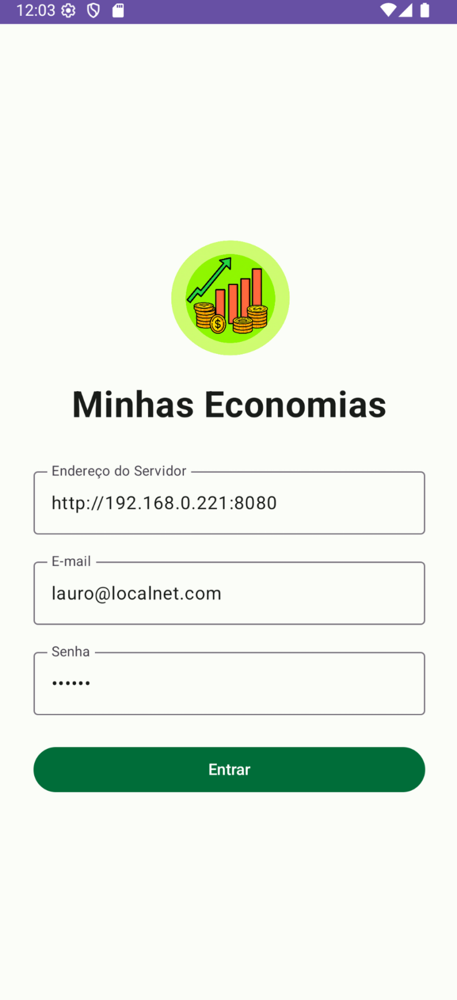
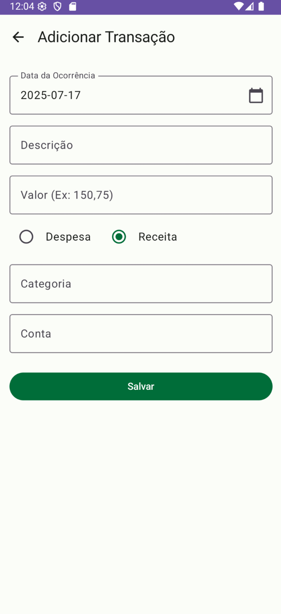
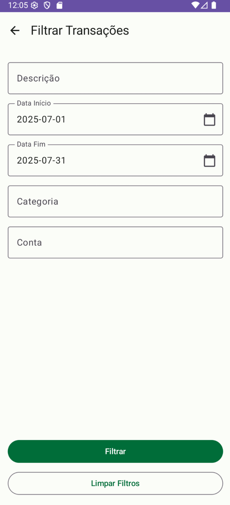
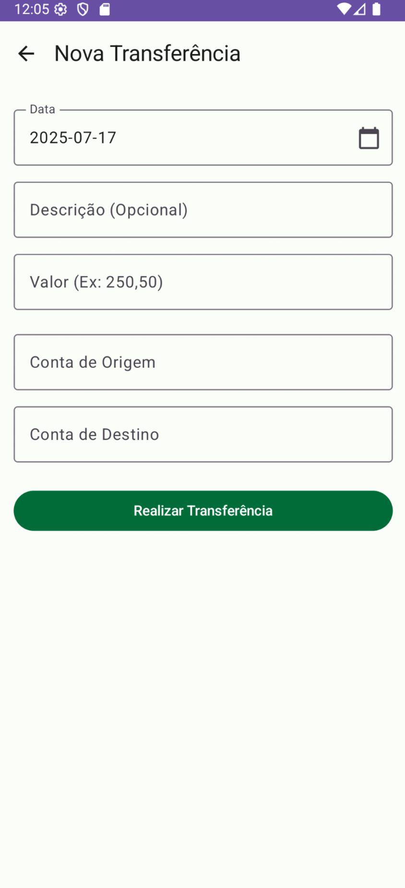

<table>
  <tr>
    <td align="center">
      
       
      <b>Tela de Login</b>
    </td>
    <td align="center">
      
       
      <b>Dashboard</b>
    </td>
    <td align="center">
      
       
      <b>Adicionar Transação</b>
    </td>
  </tr>
  <tr>
    <td align="center">
      
       
      <b>Filtrar Transações</b>
    </td>
    <td align="center">
      
       
      <b>Nova Transferência</b>
    </td>
    <td align="center">
      
       
      <b>Menu de Ações</b>
    </td>
  </tr>
</table>